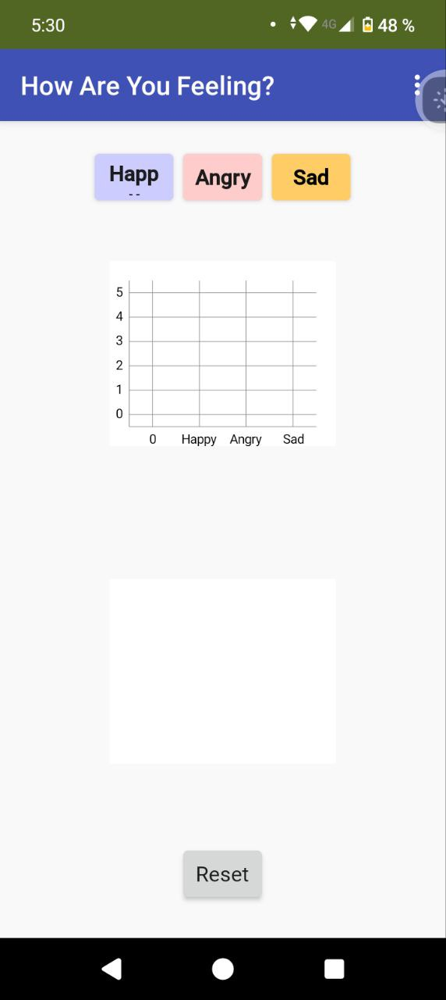
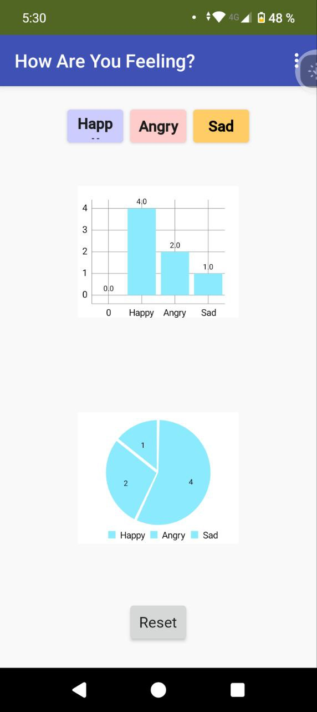

# Mood Tracker App

- Es una aplicación para dispositivos móviles hecha en MIT App Inventor que grafica el estado de ánimo que vaya introduciendo el usuario mediante el uso de los botones Happy, Angry y Sad.

  

La gráficación de los estados de ánimo se realiza con una gráfica de barras y una gráfica de pay.

  

Además cuenta con un botón de reset por si se desea volver a iniciar los datos desde cero.

